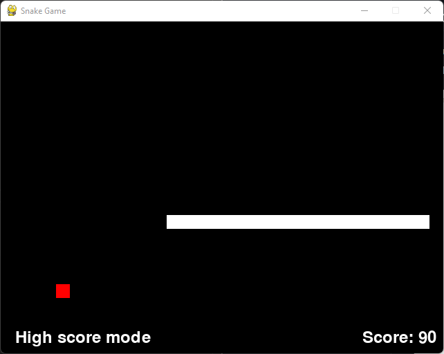
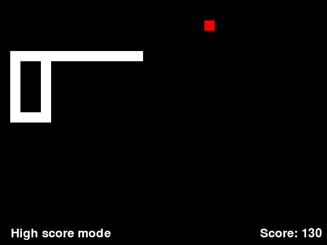

# PySnakey Documentation

## Introduction
Traditional snake game written in pygame with Python 3.11.9

## Instructions
1) Create a python environment: `python -m venv NAME_OF_VENV`.
2) Activate the environment: `source NAME_OF_VENV\bin\activate` or `NAME_OF_VENV/Scripts/activate` depending on OS
3) Install the required dependancies: `pip install -r requirements.txt`.
4) Start the game: `python snake_game.py`
5) Enjoy!

## Features
- Currently single player mode
- Main menu with key bindings options

- Bottom section is left unreachable for the consumables per level and the level itself
- Different game modes (Story mode and high-score)
    - High score

        
    
    - Story mode
        
        

- Screenshots when losing the game to see what happened and what to changed.
    - Stored under parent directory of the script running, under src -> assets -> screenshots -> date_and_time.png
    - Example image:

        

## Game modes
- High score mode 
    * Single mode where the user plays alone and the goal is to reach the highest points
    * Each food is worth 10 points
    * Stationary speed across this mode
    * Avoid clashing to itself as the game will end
    * Screenshot of the lost game would be recorded under src -> assets -> screenshots
- Story mode with levels
    * Each level has unique goals like number of food items to consume
    * The higher the level, the higher the difficulty (not yet developed)
        * Speed can increase (maybe add items to increase speed ?)
        * Food items could have times 
        * Varying level dimensions (?)
        * Obstacles in higher levels (?)
